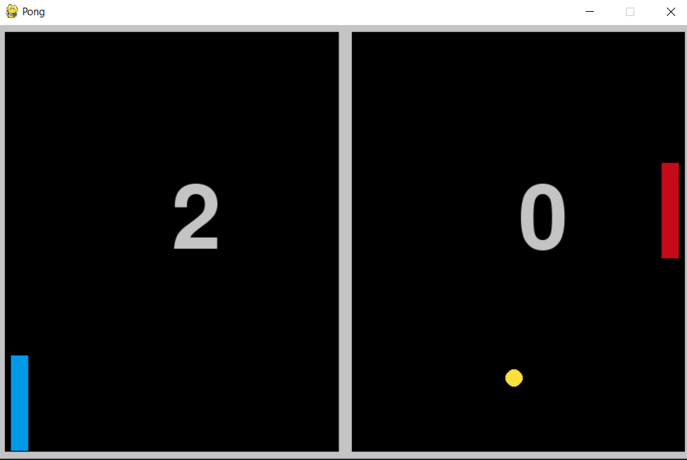

# pong_GDC
---
### Pong Game made with Pygame.

## Controls

* `up arrow key` For upward movement of paddle.
* `down arrow key` For downward movement of paddle.

## Bot

You can let bot control the paddle by adding  `paddle.activatebot(ball, isLeft)`
and reomoving `paddle.checkInp(event.key, isKeyDown)` from game loop.

* Where `ball` is object of `Ball` Class
* `isLeft` is a boolean whether the paddle is Left paddle of not.

## Screenshot

